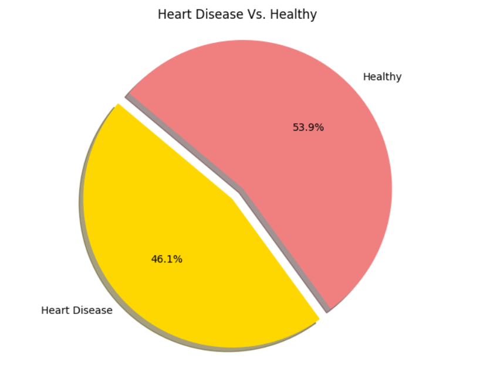

# Classifying Heart Disease
In this guided project, we will demonstrate the functionality and effectiveness of Logistic Regression modeling in Python. We will be working with a real-world dataset from the UCI Machine Learning Repository, which can be downloaded [here](https://archive.ics.uci.edu/dataset/45/heart+disease). This dataset contains medical information related to heart disease, collected by the Cleveland Clinic Foundation.

Our objective is to build a Logistic Regression model capable of predicting whether a patient has heart disease. By doing so, we will highlight the practical applications of Logistic Regression and show how it can provide valuable insights that impact health and everyday decision-making.

This guided project is provided by Dataquest. They have already cleaned the dataset for use in this project, so we will work with their version to follow along more closely.

View this project live on Google Colab [here](https://colab.research.google.com/drive/1TkabAGo13-ckZMl9jdhP--318e4soAuK?usp=sharing).
